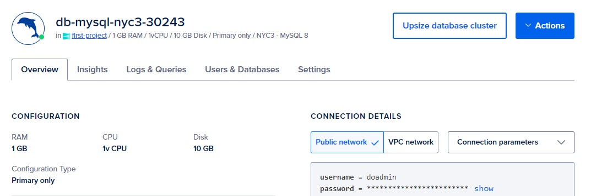
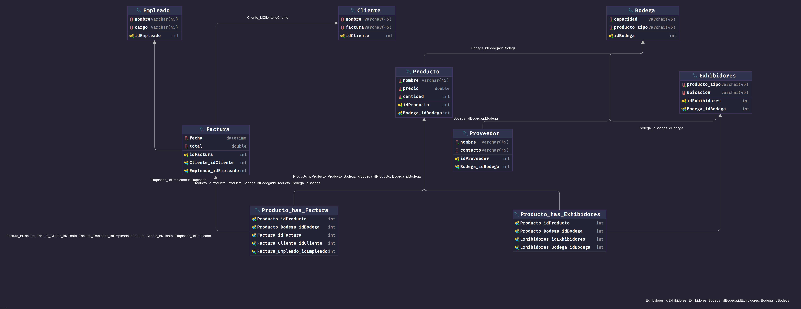

## Relational Database Documentation

### Overview
This relational database is designed to manage various entities such as `Bodega`, `Cliente`, `Empleado`, `Exhibidores`, `Factura`, `Producto`, `Proveedor`, and their relationships. The database schema ensures data integrity through the use of primary and foreign keys.

### MySQL service deployed in Digital Ocean Cluster

### Database Diagram

### Tables and Relationships

- **Bodega**: Stores information about storage locations.
    - `idBodega` (Primary Key)
    - `capacidad`
    - `producto_tipo`

- **Cliente**: Stores customer information.
    - `idCliente` (Primary Key)
    - `nombre`
    - `factura`

- **Empleado**: Stores employee information.
    - `idEmpleado` (Primary Key)
    - `nombre`
    - `cargo`

- **Exhibidores**: Stores information about display units.
    - `idExhibidores` (Primary Key)
    - `producto_tipo`
    - `ubicacion`
    - `Bodega_idBodega` (Foreign Key referencing `Bodega`)

- **Factura**: Stores invoice information.
    - `idFactura` (Primary Key)
    - `fecha`
    - `total`
    - `Cliente_idCliente` (Foreign Key referencing `Cliente`)
    - `Empleado_idEmpleado` (Foreign Key referencing `Empleado`)

- **Producto**: Stores product information.
    - `idProducto` (Primary Key)
    - `nombre`
    - `precio`
    - `cantidad`
    - `Bodega_idBodega` (Foreign Key referencing `Bodega`)

- **Producto\_has\_Exhibidores**: Manages the relationship between `Producto` and `Exhibidores`.
    - `Producto_idProducto` (Foreign Key referencing `Producto`)
    - `Producto_Bodega_idBodega` (Foreign Key referencing `Producto`)
    - `Exhibidores_idExhibidores` (Foreign Key referencing `Exhibidores`)
    - `Exhibidores_Bodega_idBodega` (Foreign Key referencing `Exhibidores`)

- **Producto\_has\_Factura**: Manages the relationship between `Producto` and `Factura`.
    - `Producto_idProducto` (Foreign Key referencing `Producto`)
    - `Producto_Bodega_idBodega` (Foreign Key referencing `Producto`)
    - `Factura_idFactura` (Foreign Key referencing `Factura`)
    - `Factura_Cliente_idCliente` (Foreign Key referencing `Factura`)
    - `Factura_Empleado_idEmpleado` (Foreign Key referencing `Factura`)

- **Proveedor**: Stores supplier information.
    - `idProveedor` (Primary Key)
    - `nombre`
    - `contacto`
    - `Bodega_idBodega` (Foreign Key referencing `Bodega`)

