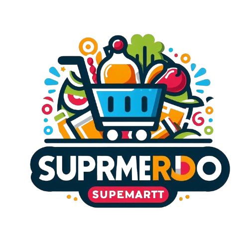

### Documentación del Proyecto Next.js

Este proyecto es una aplicación web construida con Next.js, un framework de React que permite la creación de aplicaciones web modernas con renderizado del lado del servidor (SSR) y generación de sitios estáticos (SSG). A continuación, se proporciona una breve descripción de cada directorio y archivo en el proyecto, integrado con el árbol de directorios proporcionado.


## Arquitectura a 3 capas y Microservicios

La arquitectura a 3 capas con microservicios es una solución óptima para este proyecto por varias razones:

1. **Separación de responsabilidades**: La arquitectura a 3 capas divide la aplicación en tres capas distintas: presentación, lógica de negocio y acceso a datos. Esto facilita el mantenimiento y la escalabilidad del proyecto, ya que cada capa puede desarrollarse, probarse y desplegarse de manera independiente.

2. **Escalabilidad**: Los microservicios permiten escalar cada componente de la aplicación de manera independiente. Si una parte específica de la aplicación experimenta una alta demanda, solo esa parte puede escalarse sin necesidad de escalar toda la aplicación, lo que optimiza el uso de recursos.

3. **Flexibilidad en el desarrollo**: Con los microservicios, diferentes equipos pueden trabajar en distintos servicios de manera simultánea sin interferir entre sí. Esto acelera el desarrollo y permite una mayor flexibilidad en la elección de tecnologías y lenguajes de programación para cada servicio.

4. **Resiliencia**: La arquitectura de microservicios mejora la resiliencia de la aplicación. Si un microservicio falla, los demás pueden seguir funcionando, lo que reduce el impacto de los errores y mejora la disponibilidad general del sistema.

5. **Despliegue continuo**: Los microservicios facilitan el despliegue continuo y la integración continua (CI/CD). Cada servicio puede desplegarse de manera independiente, lo que permite actualizaciones más rápidas y frecuentes sin interrumpir el funcionamiento de la aplicación.

# Video Demostración del Proyecto
[](https://www.youtube.com/watch?v=UCiclZ6KN2s)
.Debe darle click a la imagen

## Mapa de clases
```bash
.
├── ./api (Contiene las clases para el CRUD)
│   └── ./api/fetchRecords.tsx
├── ./components (Contiene componente reusables y el layout del proyecto)
│   ├── ./components/layout
│   │   ├── ./components/layout/Footer.tsx
│   │   ├── ./components/layout/Header.tsx
│   │   ├── ./components/layout/Layout.tsx
│   │   └── ./components/layout/Sidebar.tsx
│   └── ./components/my_k
│       ├── ./components/my_k/Button.tsx
│       ├── ./components/my_k/Card.tsx
│       ├── ./components/my_k/Modal.tsx
│       └── ./components/my_k/Table.tsx
├── ./lib (Autentica la base de datos con el host web)
│   ├── ./config/db.tsx
│   └── ./config/dbTest.js
├── ./context
│   └── ./context/AuthContext.tsx
├── ./hoc
│   └── ./hoc/withAuth.tsx
├── ./pages (Enruta las paginas segun el flujo de usuario)
│   ├── ./pages/404.tsx
│   ├── ./pages/_app.tsx
│   ├── ./pages/dashboard (Redirecciona a la GUI de cada entidad)
│   │   ├── ./pages/dashboard/E_Bodega.tsx
│   │   ├── ./pages/dashboard/E_Cliente.tsx
│   │   ├── ./pages/dashboard/E_Empleado.tsx
│   │   ├── ./pages/dashboard/E_Exhibidor.tsx
│   │   ├── ./pages/dashboard/E_Factura.tsx
│   │   ├── ./pages/dashboard/E_Producto.tsx
│   │   ├── ./pages/dashboard/E_Proveedor.tsx
│   │   ├── ./pages/dashboard/dummy.js
│   │   └── ./pages/dashboard/index.tsx
│   └── ./pages/index.tsx
├── ./prisma (Contiene el schema para crear un bd en prisma)
│   └── ./prisma/schema.prisma
├── ./public (Contiene el contenido multimedia usado)
│   ├── ./public/Arch.jpg
│   ├── ./public/Default
│   │   ├── ./public/Default/file.svg
│   │   ├── ./public/Default/globe.svg
│   │   ├── ./public/Default/next.svg
│   │   ├── ./public/Default/vercel.svg
│   │   └── ./public/Default/window.svg
│   ├── ./public/Efe.png
│   ├── ./public/Logo.png
│   └── ./public/covers
│       ├── ./public/covers/bodega.jpg
│       ├── ./public/covers/cliente.jpg
│       ├── ./public/covers/empleado.jpg
│       ├── ./public/covers/exhibidor.jpg
│       ├── ./public/covers/factura.jpg
│       ├── ./public/covers/producto.jpg
│       └── ./public/covers/proveedor.jpg
└── ./styles (Contiene los estilos por clase)
    ├── ./styles/Algomas.module.scss
    ├── ./styles/Dashboard.module.scss
    ├── ./styles/E_dynamic.module.scss
    ├── ./styles/Footer.module.scss
    ├── ./styles/Header.module.scss
    ├── ./styles/Home.module.scss
    ├── ./styles/Layout.module.scss
    ├── ./styles/Sidebar.module.scss
    ├── ./styles/global.css
    └── ./styles/not.module.scss
```

### **Flujo de la Aplicación**

1. **Inicio:**
   - El usuario accede a la aplicación en `/` y, tras autenticarse, es redirigido al `/dashboard`.

2. **Dashboard:**
   - La vista principal muestra resúmenes en tarjetas (`Card.tsx`).
   - Navegación lateral (`Sidebar`) para acceder a las páginas de CRUD.

3. **CRUDs:**
   - Cada tabla tiene su página (`E_Bodega.tsx`, etc.) con una tabla (`Table.tsx`) para datos y botones para interactuar con ellos.
   - Crear/editar registros abre un modal con un formulario personalizado.

4. **Relaciones:**
   - Las tablas relacionadas (e.g., `Producto_has_Factura`) gestionan sus relaciones en formularios o tablas específicas.

### **Interacción del Usuario**

- **Inicio:** El usuario accede a la aplicación en `/` y, tras autenticarse, es redirigido al `/dashboard`.
- **Dashboard:**
  - La vista principal muestra resúmenes en tarjetas (`Card.tsx`).
  - Navegación lateral (`Sidebar`) para acceder a las páginas de CRUD.
- **CRUDs:**
  - Cada tabla tiene su página (`E_Bodega.tsx`, etc.) con una tabla (`Table.tsx`) para datos y botones para interactuar con ellos.
  - Crear/editar registros abre un modal con un formulario personalizado.
- **Relaciones:**
  - Las tablas relacionadas (e.g., `Producto_has_Factura`) gestionan sus relaciones en formularios o tablas específicas.

